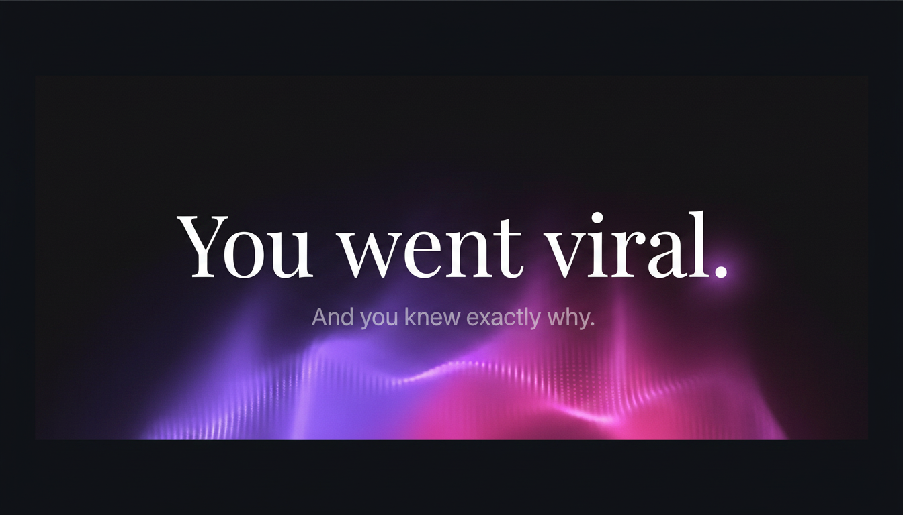
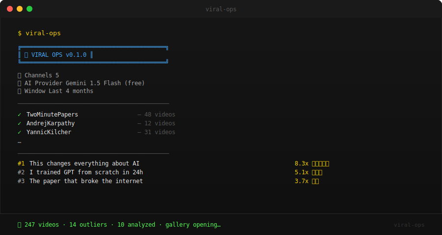

# viral-ops

<div align="center">

<br>

<a href="https://www.instagram.com/thomasabatojr/" target="_blank">
  
</a>

<br>

[](https://github.com/tabato/viral-ops/actions/workflows/ci.yml)
[](https://www.python.org/)
[](LICENSE)
[](https://developers.google.com/youtube/v3)
[](https://aistudio.google.com/)
[](https://anthropic.com)
[](https://openai.com)

<br>

### *Your competitors already blew up. Now you can too.*

<br>

`250+ videos` &nbsp;·&nbsp; `10 viral blueprints` &nbsp;·&nbsp; `30 AI copy angles` &nbsp;·&nbsp; `90 seconds`

</div>

<br>

**viral-ops** scans YouTube channels you admire, scores every video by how far it outperformed that channel's average, surfaces the top outliers, and uses AI to explain *exactly* why each one went viral — then generates three copy angles tailored to your niche.

Outputs: a swipe file in Markdown and a beautiful dark-mode gallery that opens in your browser automatically.

---

## Core Capabilities

- **Channel scanning** — point it at any YouTube handle or channel ID, it handles the rest
- **Virality scoring** — every video gets a score: `views ÷ channel average`. No guessing, no vibes
- **Outlier detection** — anything above your threshold (default 2×) is flagged automatically
- **AI analysis** — the top 10 outliers are analyzed for hook mechanics, viral drivers, and 3 copy angles tailored to your exact niche
- **Dark-mode gallery** — thumbnails in a YouTube-style grid, virality badges, copy angles on hover, auto-opens in your browser
- **Swipe file** — every hook, title, and copy angle saved to a clean Markdown file you can reference any time
- **Multi-provider AI** — Gemini free tier by default, Claude or OpenAI as alternatives — one line in your config

---

## Demo



> *Full demo GIF coming soon — star the repo to get notified when it drops.*  
> *Replace `assets/demo-placeholder.svg` with `assets/demo.gif` when ready.*

---

## viral-ops vs. doing it manually

| | viral-ops | Manual Research |
|---|---|---|
| Time per full scan | ~2 minutes | 2–4 hours |
| Channels at once | Unlimited | One at a time |
| Virality scoring | Automatic (math) | Eyeballed |
| AI copy angles | ✅ Instant, niche-specific | ❌ Copy-paste to ChatGPT separately |
| Gallery export | ✅ Auto-opens in browser | ❌ Screenshot folder chaos |
| Swipe file | ✅ Clean Markdown | ❌ Notes app |
| Repeatable | ✅ One command | ❌ Start over every time |

---

## Quick start

```bash
# 1. Clone and install
git clone https://github.com/tabato/viral-ops.git && cd viral-ops
pip install -e .

# 2. Configure
cp templates/profile.example.yml profile.yml
cp templates/creators.example.yml creators.yml
cp templates/.env.example .env   # add your API keys

# 3. Run
viral-ops
```

That's it. Gallery opens automatically when the run finishes.

---

## API setup

### Gemini — FREE, no billing required (recommended)

Get a free key at [aistudio.google.com/app/apikey](https://aistudio.google.com/app/apikey) — no credit card, instant.  
Free tier: **15 req/min · 1M tokens/day · $0**.

→ Full setup guide: [GEMINI.md](GEMINI.md)

### Claude (Anthropic)

Paid API. Best if you want more voice-forward copy angles or are already on an Anthropic plan.  
Uses `claude-sonnet-4-6` · ~$0.50 per full run.

→ Full setup guide: [CLAUDE.md](CLAUDE.md)

---

## YouTube API key

1. Go to [console.cloud.google.com](https://console.cloud.google.com/apis/library/youtube.googleapis.com)
2. Enable **YouTube Data API v3**
3. Create an API key under **Credentials**
4. Add to `.env`:
   ```
   YOUTUBE_API_KEY=your_key_here
   ```

The free tier gives 10,000 quota units/day. A typical viral-ops run (5 channels, 4 months) uses ~60–80 units.

---

## Usage philosophy

viral-ops is a **research tool**, not a content copy machine.

It tells you *why* things work — the psychological hooks, the format patterns, the timing signals. What you do with that is up to you. The copy angles it generates are starting points for your own voice, not scripts to paste verbatim.

The best creators don't copy what went viral. They understand it well enough to make their own version better.

---

## profile.yml reference

```yaml
niche: "AI tools and productivity for developers"
target_audience: "Software engineers who want to leverage AI to ship faster"
content_style: "Practical tutorials, no-fluff, fast-paced screen recordings"

# FREE ✨ | gemini   claude   openai
ai_provider: gemini

virality_threshold: 2.0   # flag videos that outperform channel avg by this multiple
months_back: 4            # how far back to scan
```

The more specific your `niche` and `target_audience`, the sharper the AI copy angles.

---

## creators.yml reference

```yaml
creators:
  - "@TwoMinutePapers"
  - "@AndrejKarpathy"
  - "UCX6OQ3DkcsbYNE6H8uQQuVA"   # channel ID also works
```

Mix handles (`@handle`) and channel IDs freely.

---

## Output files

| File | What's in it |
|---|---|
| `gallery.html` | Dark-mode YouTube-style grid — thumbnails, virality score badges, copy angles on hover, analysis expandable below each card. Auto-opens in browser. |
| `swipe_file.md` | Full analysis for each outlier: hook breakdown, why it went viral, 3 copy angles for your niche. |
| `thumbnails/` | Downloaded thumbnail images (referenced by gallery.html) |

---

## CLI options

```
viral-ops [OPTIONS]

Options:
  -p, --profile PATH     Path to profile.yml      [default: profile.yml]
  -c, --creators PATH    Path to creators.yml     [default: creators.yml]
  -o, --output PATH      Output directory         [default: .]
      --top INTEGER      Top N outliers to analyze [default: 10]
      --no-browser       Don't auto-open gallery
      --help
```

---

## How virality score works

```
virality_score = video_views / channel_average_views
```

A score of `3.5x` means that video got 3.5× more views than that channel's typical video in the same time window. This controls for channel size — a 100K-view video on a small channel can outperform a 1M-view video on MrBeast.

Videos above `virality_threshold` (default `2.0`) are flagged as outliers. The top 10 are analyzed.

---

## Disclaimers

- viral-ops uses the YouTube Data API v3 in compliance with [YouTube's Terms of Service](https://www.youtube.com/t/terms)
- No video content is downloaded — only metadata and publicly available thumbnails
- AI-generated copy angles are starting points, not finished scripts. Use them as inspiration, not output
- Respect the creators whose content you're studying. Understand the pattern, don't lift the execution

---

## Inspiration

Inspired by **[career-ops](https://github.com/santifer/career-ops)**.

---

## 🔥 Went viral using viral-ops? [Share it.](https://github.com/tabato/viral-ops/issues/new?labels=went-viral&title=I+went+viral+using+viral-ops)

---

## License

MIT © 2026

---

## Let's connect

If you're building something, making content, or just want to talk — find me here:

[](https://www.instagram.com/thomasabatojr/)
[](https://www.youtube.com/@ThomasAbato)
[](https://www.tiktok.com/@thomasabato)
[](https://x.com/thomasabato)
[](https://www.linkedin.com/in/thomasabato/)